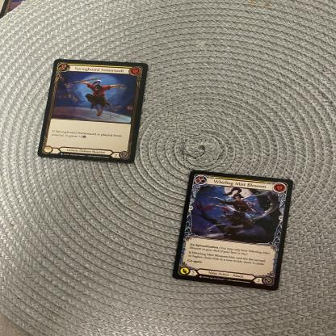
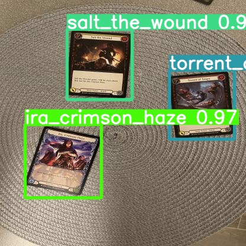

# Flesh and Blood Card Detector

## Overview
In this project, I trained a YOLOv8 model on synthetic data to detect real cards from the Trading Card Game (TCG), [Flesh and Blood ](https://fabtcg.com/). The motivation for this project was the software [SpellTable](https://spelltable.wizards.com/) which allows cards to be detected through a webcam for the TCG *Magic The Gathering*. More detailed information can be found in the provided PDF report.

## Dataset
The dataset is hosted using *RoboFlow* and can be found at the following link, https://universe.roboflow.com/flesh-and-blood-dataset/full-dataset-ktr4z/dataset/3

## Synthetic Training Dataset
A synthetic dataset needed to be constructed because of the lack of resources necessary for creating a completely non-synthetic dataset. *Flesh and Blood* contains hundreds of different cards with more being added with every expansion. The only way that this project would have been feasible is by automating the process with a synthetic dataset. This was done by randomly placing PNGs of cards on a background from the [Oxford Describable Textures Dataset (DTD)](https://www.robots.ox.ac.uk/~vgg/data/dtd/). I intended to generate a certain number of images using random backgrounds to create a robust model. Augmentations to the images are also applied for the same reason of increasing model robustness. For this experiment, I only used a subset of 13 cards to simplify the development of the real-life dataset. Below is an example of a generated image.

## Real-Life Dataset
~100 images were taken and hand-annotated to test the performance of a synthetically trained model. Images were taken on an iPhone and a webcam to test different camera types that users might have. An example of a test image can be seen in the following image.

## Results
Results from the *YOLOv8* can be seen in the following image. The results show promise in the ability to detect real-life images and overcome the problem of domain shift present in problems like this.

